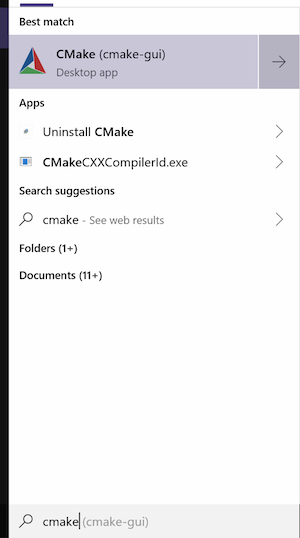
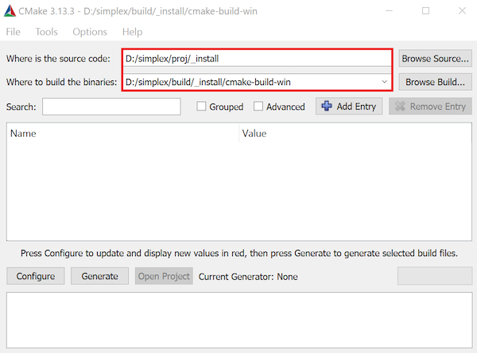
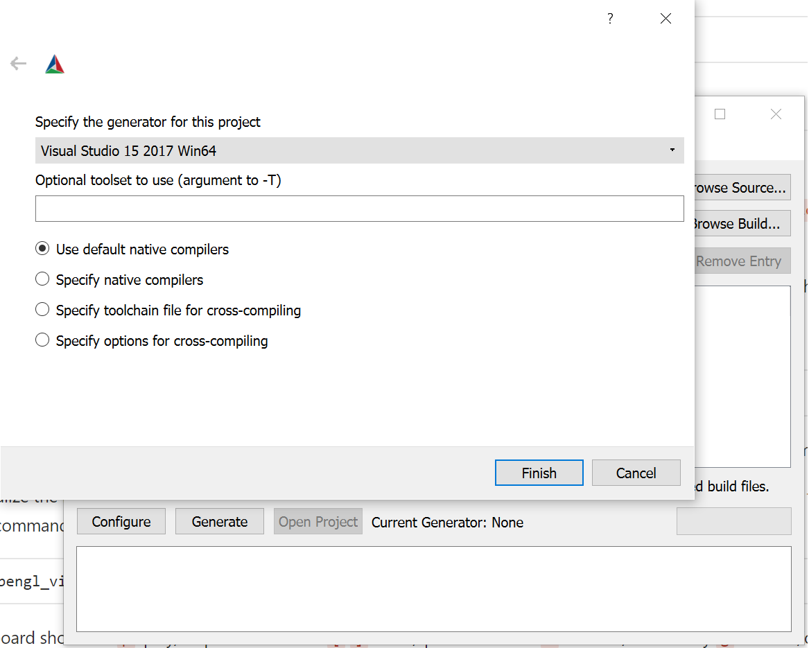
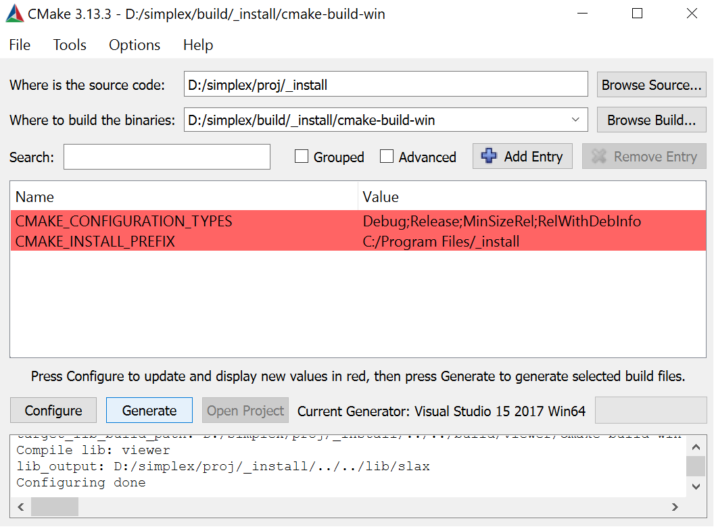

# Code checkout

## Cloning via SSH on Windows

If you created your GitLab account using a third-party login (Google, GitHub, etc.), you will likely be unable to clone the respository via HTTPS. However, you can clone it with SSH.

### Generating an SSH Key
1.  Open Git Bash
2.  Create a New SSH Key with your email as the label        

        $ ssh-keygen -t rsa -b 4096 -C "your_email@example.com"
3. Save the SSH Key in the default location by pressing enter when asked to specify a location

        > Enter a file in which to save the key (/c/Users/you/.ssh/id_rsa):[Press enter]

4. Type a secure password for your SSH Key when prompted

        > Enter passphrase (empty for no passphrase): [Type a passphrase]
        > Enter same passphrase again: [Type passphrase again]

### Adding the SSH Key to ssh-agent (Bo: do we need this step?)

1.  Manually launch ssh-agent in the background

        $ eval $(ssh-agent -s)
        > Agent pid #####

2. Add your key to SSH agent

        $ ssh-add ~/.ssh/id_rsa

### Adding the SSH key to your GitLab account

1. Copy the SSH key to your clipboard

        $ clip < ~/.ssh/id_rsa.pub

2. Navigate to Settings -> SSH Keys. Paste in the copied SSH key, using the default title, and press "Add Key."
3. The repository can now be cloned with SSH

        $ git clone git@gitlab.com:boolzhu/simplex.git

# Compile and run the sample code
Check the sample projects under /proj. For the first step, you need to build /proj/_install to generate .lib files for all the external and internal libraries.

#### Build precompiled libraries on Windows:
**Notice, on Windows, using Cmake in cmd line may causes a compile error after generating the VS project. So the Cmake GUI is recommended.**

1. Open Cmake GUI.

2. Add source code `[Your path]/simplex/proj/_install` and build `[Your path]/simplex/build/_install/cmake-build-win`.

3. Click on the left bottom button `Configure`. Specify the generator for this project as `Visual Studio 15 2017 Win64`.

4. Click on the next button `Generate`.

5. Click on the next button `Open_Project` to open Visual Studio.

6. Compile the code in VS with Release, x64. Build.

#### Build precompiled libraries on Linux:

1. Create a build folder: `[Your path]/simplex/build/_install/cmake-build-unix`

2. cd to the build folder and run CMake with specified source code path: `cmake [Your path]/simplex/proj/_install -DCMAKE_BUILD_TYPE=Release`.
        - Note for most cases, you'll use the Release version (specified by -DCMAKE_BUILD_TYPE=Release) which has much better performance optimized by the complier.

2. In the same folder, run `make` to compile.

3. Repeat step 1-2 for fluid\_euler and opengl\_viewer.

Once successfully building the library, you should be able to see the compiled libraries in lib/ext and lib/slax.

#### Build the OpenGL Viewer:
1. Repeat step 1-6 for proj/opengl\_viewer. After successful build, you should be able to find the opengl_viewer.exe in bin/win/opengl_viewer/Release/opengl_viewer.exe
2. Set the executable as a environment variable 'o'.

#### Build and run the fluid euler project:

1. Build the proj/fluid_euler project as abo e.

2. In `[Your path]/simplex/bin/win/fluid_euler/Release`, run command:

        fluid_euler.exe -test 3 -s 64 -lf 200 -o water

    Arguments:
    -test: 3, droplet falling into water; 4. droplet oscillation with surface tension
    -s: resolution
    -lf: last frame
    -o: output folder

2. Visualize the result with the opengl viewer:
copy `opengl_viewer.exe` and its dlls in `ext/_dll` to the same folder as fluid_euler.exe, run command

        opengl_viewer.exe -m fluid -o water
Or, if you have set the environmental variable, use:
    %o% -m fluid -o water

### The usage of OpenGL Viewer

Our OpenGL Viewer provides different functions. You can use it to check the simulation results at first time, and also use it to debug. Especially we support a color encoding mode, in which you can see the index number of a particle in a geometric particle system.

    Keyboard shortcuts:
    `p`: play/stop the animation
    `[` `]`: next / previous frame
    `v`: turn on/off velocity
    `g`: turn on/off grid
    `l`: turn on/off levelset field
    `w`: offscreen rendering
    `O`: turn on/off color encoding debug mode

See the manual for details ([EN](/docs/viewer-usage.md)).

# Generate animation movies

1. In the viewer, press `w` to turn on the offscreen rendering mode. Then press `p` to play the animation in the viewer. A sequence of frames will be written to `[your output path]/_images` (e.g., `water/_images`)

2. Use ffmpeg to generate video.

    ffmpeg -framerate 25 -i [output]/_images/%4d.png -c:v libx264 -vf scale=640:-1 -pix_fmt yuv420p [output]/_images/out.mp4
    ffmpeg -framerate 25 -i [output]/_images/%4d.png -c:v libx264 -vf "crop=trunc(iw/2)*2:trunc(ih/2)*2" -pix_fmt yuv420p [output]/_images/out.mp4

(Reference: https://trac.ffmpeg.org/wiki/Slideshow)
(Reference: https://stackoverflow.com/questions/20847674/ffmpeg-libx264-height-not-divisible-by-2/29582287#29582287)

If you use WSL, you may create a bash file for templaterized command call (see a bash file in `simplex/script/ani.bash` for example). You may also add command aliases in the WSL .bashrc file (like Windows environmental variables) for quick access:

    cd ~
    (goto home dir)
    nano .bashrc
    (open the .bashrc file with nano)

Then append the following text to the end of the file and save the file:

    # customized aliases
    alias ani='[Your path]/simplex/script/ani.bash'

    source .bashrc
    (update the aliases)

# How to start your own project

## Programming style guide

Please see our code specification guide ([EN](/docs/code-specification.md)) before you start to write codes.

## How to write CMakeLists.txt

If you want to create a own project, or add a library to `simplex/src` or `simplex/ext`, you need to write a CMakeLists.txt file. Please see our compilation documentation to know how to do that ([中文](/docs/compilation-notes-zh.md)).

If you want to modify our cmake script files, please see the notes ([中文](/docs/cmake-dev-zh.md)), and contact with `simplex` infrastructure develop team.

## How to read simulator parameters from file

You can read parameters of your simulator (i.e., the fluid density, viscosity, atmosphere pressure...) from a file. We provide an easy-to-use interface ([中文](/docs/fileinit-usage.md)) for this purpose with strong automatic error detections.

## Profile your code
You can use `Timer` class to record the instantaneous/avaerage time of each part of your main loop([中文](/docs/timer-usage-zh.md)).

# Use Vcpkg to Install Libraries

See our vcpkg manual ([EN](/docs/vcpkg-usage.md)).
