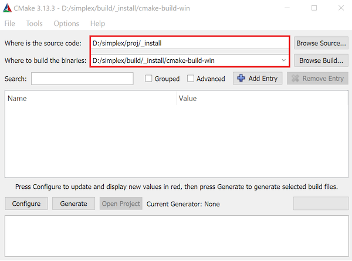
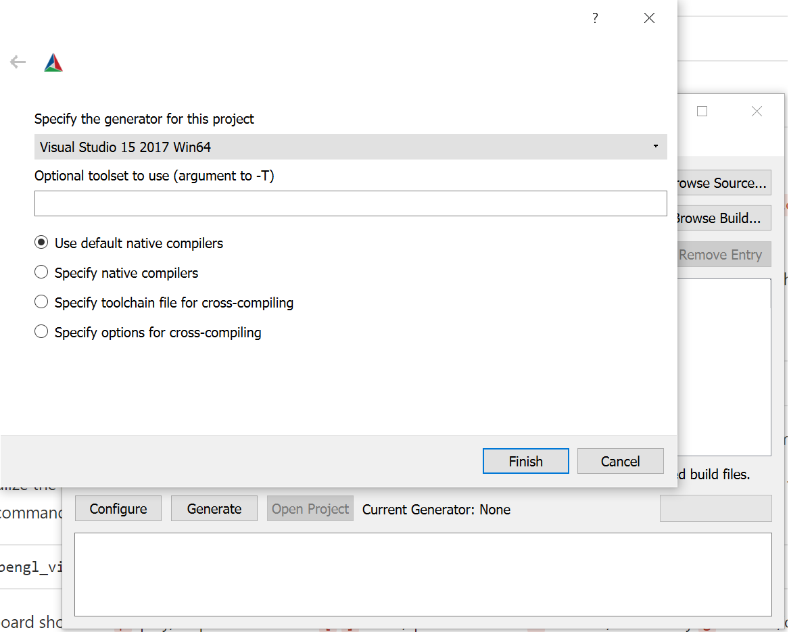
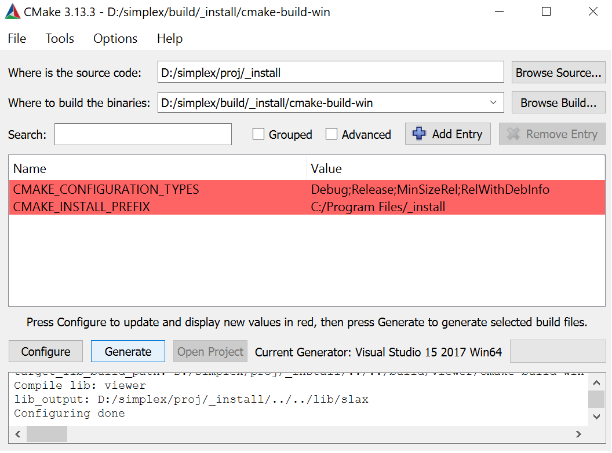
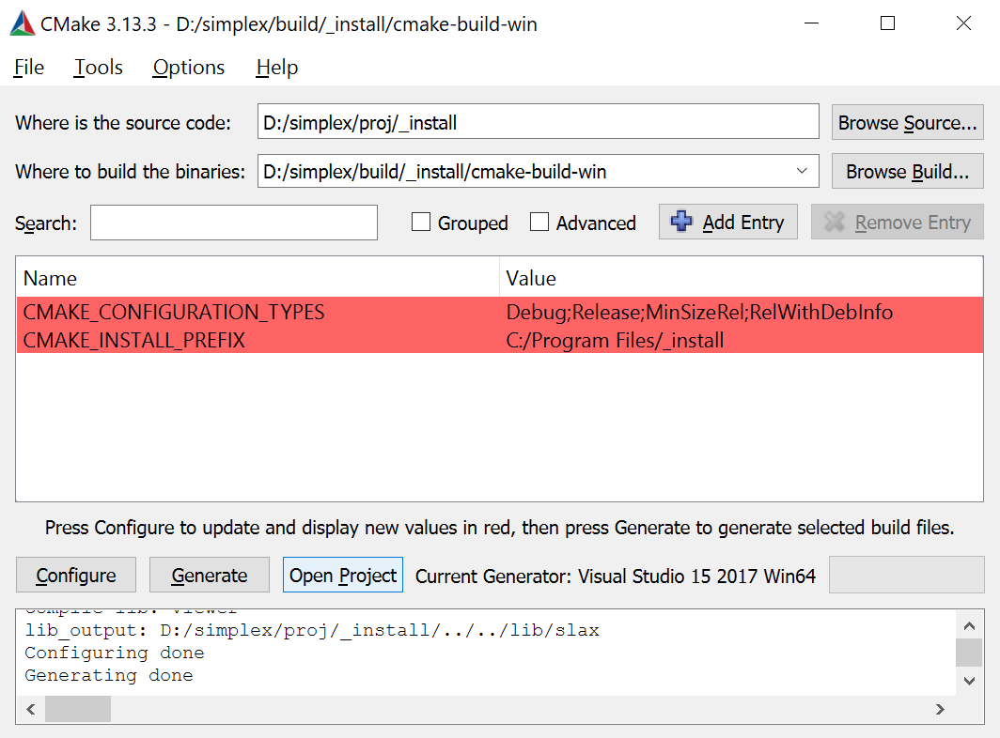
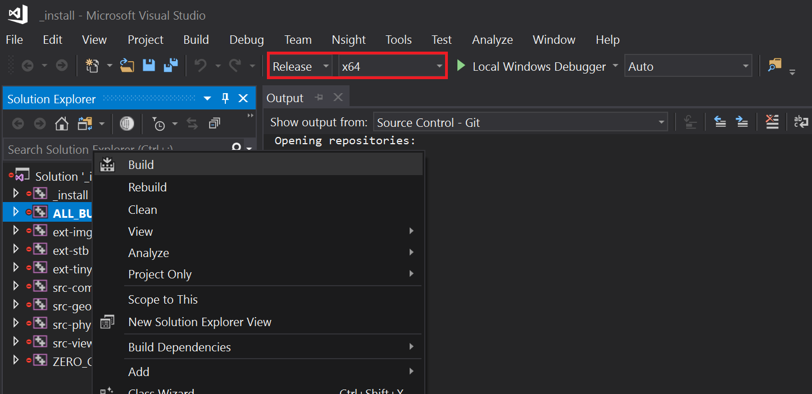
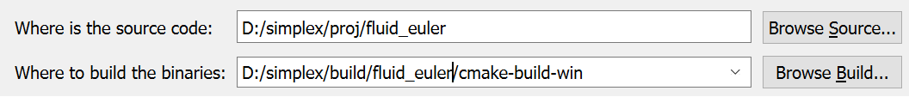
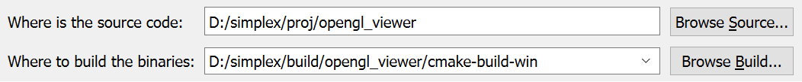

# Checkout SimpleX from Git

### Step 0: Create a GitLab account

### Step 1: Generate an SSH Key
1.  Open a command line window (e.g., Git Bash) 
2.  Create a New SSH Key with your email as the label        
    
        $ ssh-keygen -t rsa -b 4096 -C "your_email@example.com"
3. Save the SSH Key in the default location by **pressing enter** when asked to specify a location
   
        > Enter a file in which to save the key (/c/Users/you/.ssh/id_rsa):[Press enter]

4. Type a secure password for your SSH Key when prompted (**press enter** if you don't need a password)

        > Enter passphrase (empty for no passphrase): [Type a passphrase]
        > Enter same passphrase again: [Type passphrase again]
    
### Step 2: Adding the SSH Key to ssh-agent (optional)

1.  Manually launch ssh-agent in the background

        $ eval $(ssh-agent -s)
        > Agent pid #####

2. Add your key to SSH agent

        $ ssh-add ~/.ssh/id_rsa
    

### Step 3: Adding the SSH key to your GitLab account

1. Copy the SSH key to your clipboard (on Windows. For Linux you may use any text editor to open the pub file and copy everything from there)

        $ clip < ~/.ssh/id_rsa.pub
    
2. On your GitLab account page, navigate to `Settings -> SSH Keys`, paste in the copied SSH key, use the default title, and press "Add Key.

### Step 4: Clone the repo from GitLab
```
	git clone git@gitlab.com:boolzhu/simplex.git
```


# Install precompiled libraries with CMake
After we clone the code repository to a local file folder, the next step is to build `/proj/_install` to generate .lib files to install all the external and internal libraries. To do this, you need to have CMake on your computer. Here I take the installation on Windows for example. The Linux environment is similar.

### Step 0: Install CMake

### Step 1: Build precompiled libraries (on Windows)
Here I show two ways to build a project in SimpleX, by using a CMake GUI (on Windows) and by using the command line (on Linux). This is general for building all the projects (including your own customized one). All the project source code is structured under the folder /proj/. 

1. Open Cmake GUI.


2. Add source code `[Your path]/simplex/proj/_install` and build `[Your path]/simplex/build/_install/cmake-build-win`.



3. Click on the left bottom button `Configure`. Specify the generator for this project as `Visual Studio 15 2017 Win64`.  **(Make sure you select Win64!)**



4. Click on the next button `Generate`.



5. Click on the next button `Open_Project` to open Visual Studio.



6. Compile the code in VS with Release, x64. Build.



### Step 2: Build precompiled libraries (on Linux)

1. Create a build folder: `[Your path]/simplex/build/_install/cmake-build-unix`

2. cd to the build folder and run CMake with specified source code path: `[Your path]/simplex/proj/_install`.
```
cmake  [Your path]/simplex/proj/_install
```

2. In the same folder, run `make` to compile.
```
make
```


# Build sample projects: #
### Step 0: Build projects

Here we build two sample projects opengl_viewer and fluid_euler to demonstrate a typical simulation and visulization workflow in SimpleX.

1. Repeat the aforementioned steps for proj/opengl\_viewer to build your OpenGL viewer. After a successful build, you should be able to find the opengl_viewer.exe in bin/win/opengl_viewer/Release/opengl_viewer.exe.

2. The fluid\_euler project takes the same steps.






### Step 1: Run the fluid euler project:

1. In `[Your path]/simplex/bin/win/fluid_euler/Release`, run command: 
```
	fluid_euler.exe -test 3 -s 64 -lf 200 -o water
```
    Arguments:
    -test: 3, droplet falling into water; 4. droplet oscillation with surface tension
    -s: resolution
    -lf: last frame
    -o: output folder

### Step 2: Visualize the result with the opengl viewer: 

copy `opengl_viewer.exe` and its dlls in `ext/_dll` to the same folder as fluid_euler.exe, run command:

```opengl_viewer.exe -m fluid -o water```

Or, if you have set the environmental variable (see the section below), use:
``` %o% -m fluid -o water```

Then you should be able to see the following 2D water simulation in the viewer. Use the specified keyboard shortcuts to play the animations.

**TODO: insert a image here**

Keyboard shortcuts:

* `p`: play/stop the animation
*  `[` `]`: next / previous frame
*  `v`: turn on/off velocity
*  `g`: turn on/off grid
*  `l`: turn on/off levelset field
*  `w`: offscreen rendering


# Setting up environment variables

Run the `install_env_var.bat` under `/script/` to install all the environment variables.
```
install_env_var.bat
```
After a successful installation, you will be able to use the following shortcuts in the command line for quick access:

* simplex: the root path of simplex
* complex: the root path of complex
* o: opengl viewer
* a: generate animation
* b: quick CMake build
* imlazy: pull the latest code code from git

For example, now you can use `%o% -m fluid -o output` to visualize your fluid simulation data, without copying the viewer executable to the data folder. If you want to direct to a simplex project, you can use `cd %simplex%/proj/fluid_euler`, etc. 

You may also install these environment variables, or any customized variables you want, in a manual way.